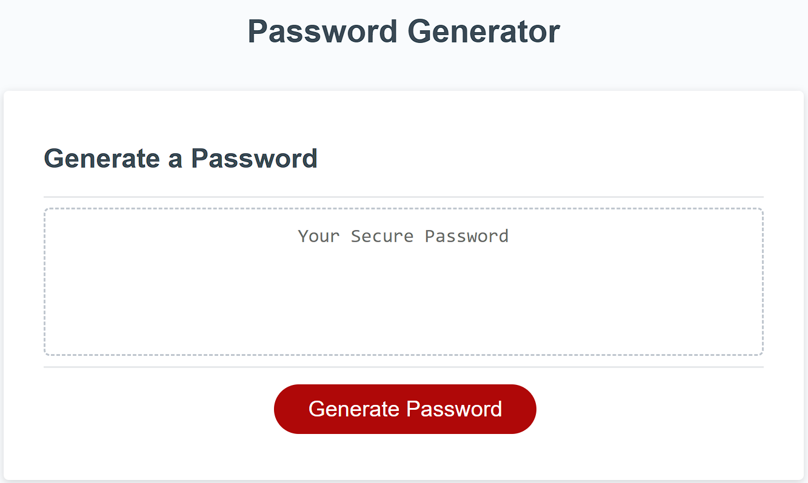
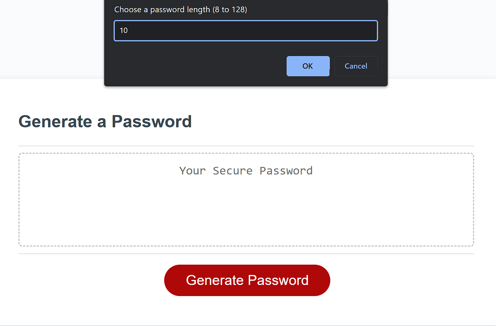
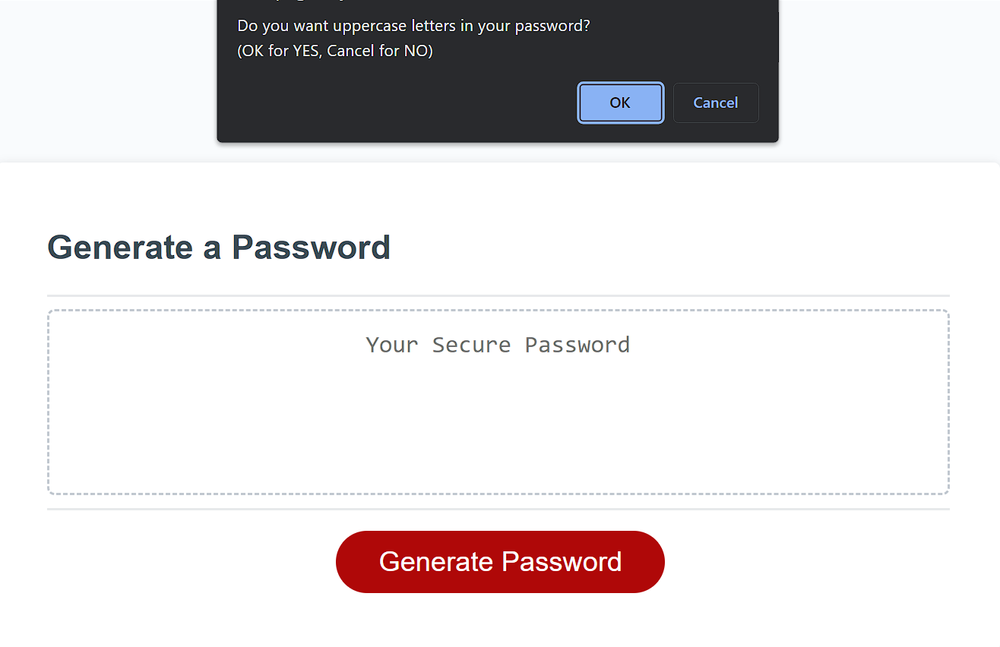
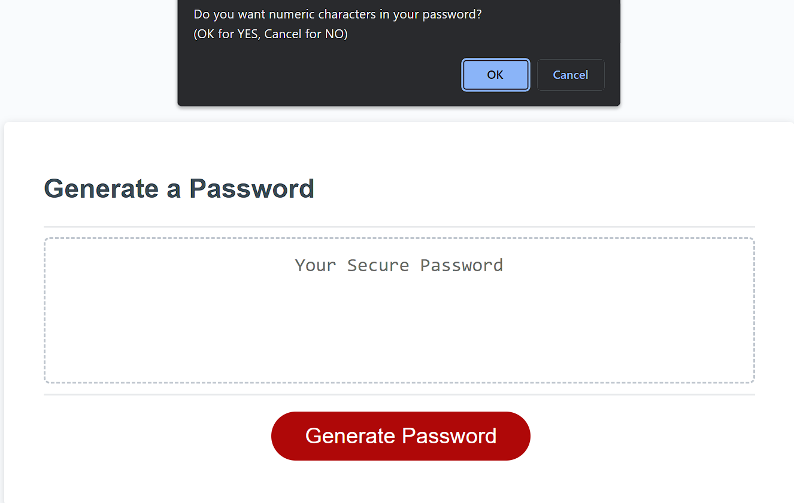
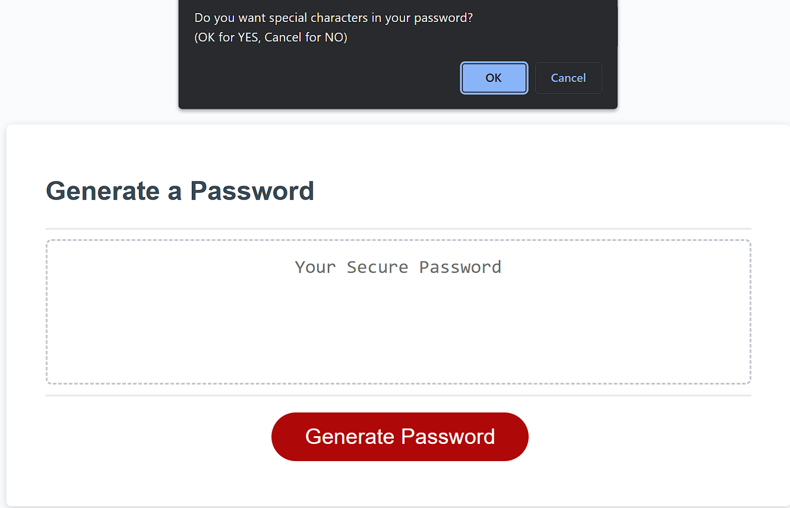
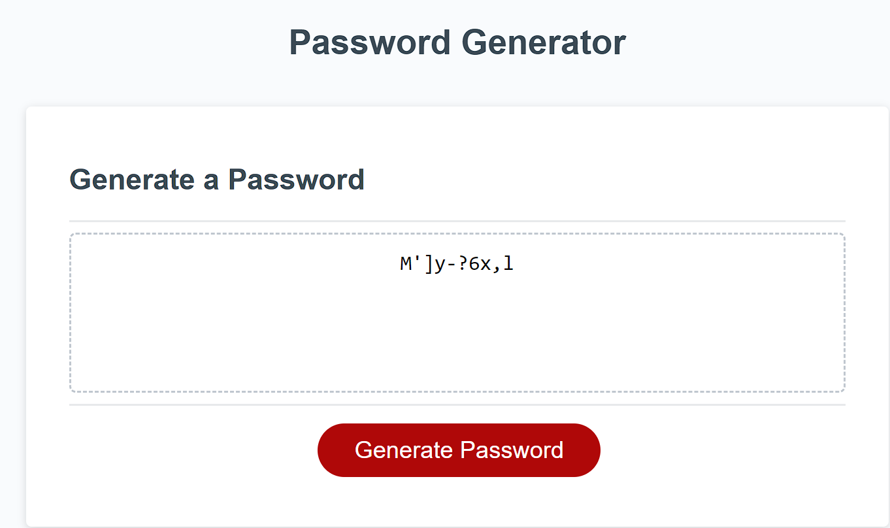
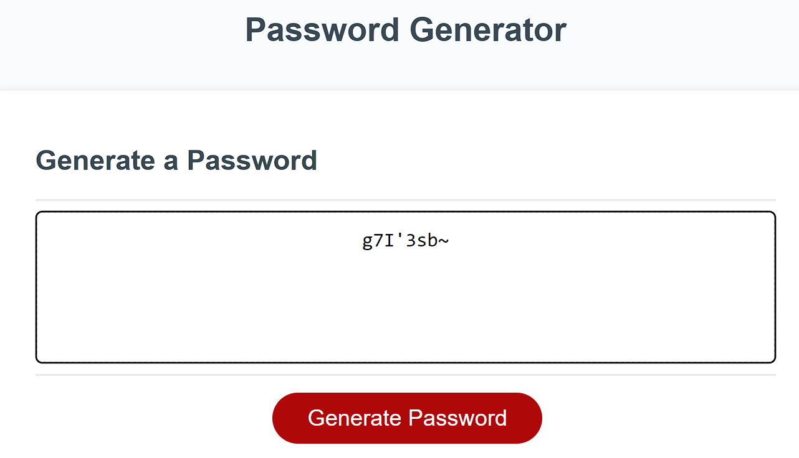
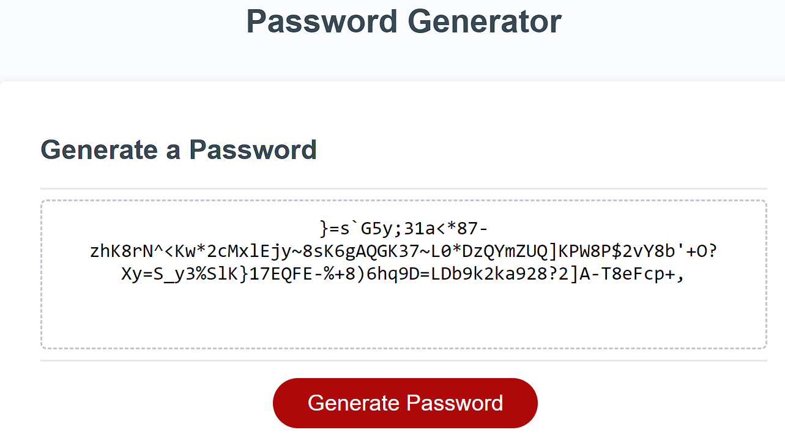

# PasswordGenerator

- This is a password generator. The program will ask the user a series of prompts then generate a password accordingly to user's choice.


## Description

- I want to create a password generator that will ask the user for the length, validate that length, then ask user which of the 4 types of characters user will want in their password, then randomly generate a password that fulfills user's requirements.


## Table of Contents 

- [Usage](#usage)
- [Links](#links)
- [Features](#features)
- [User Story](#user-story)
- [Acceptance Criteria](#acceptance-criteria)


## Usage

















 

## Links

- Github page: https://github.com/teddysm/PasswordGenerator
- Deployed page: https://teddysm.github.io/PasswordGenerator/


## Features

- This program thoroughly checks for user's input of length, wont accept characters or number that is not in required length
- This program prompts user to choose which character types they want in their password, if no type was chosen, an alert will be thrown and in the password box, it will show "No Password"


## User Story

```
AS AN employee with access to sensitive data
I WANT to randomly generate a password that meets certain criteria
SO THAT I can create a strong password that provides greater security
```

## Acceptance Criteria

```
GIVEN I need a new, secure password
WHEN I click the button to generate a password
THEN I am presented with a series of prompts for password criteria
WHEN prompted for password criteria
THEN I select which criteria to include in the password
WHEN prompted for the length of the password
THEN I choose a length of at least 8 characters and no more than 128 characters
WHEN asked for character types to include in the password
THEN I confirm whether or not to include lowercase, uppercase, numeric, and/or special characters
WHEN I answer each prompt
THEN my input should be validated and at least one character type should be selected
WHEN all prompts are answered
THEN a password is generated that matches the selected criteria
WHEN the password is generated
THEN the password is either displayed in an alert or written to the page
```